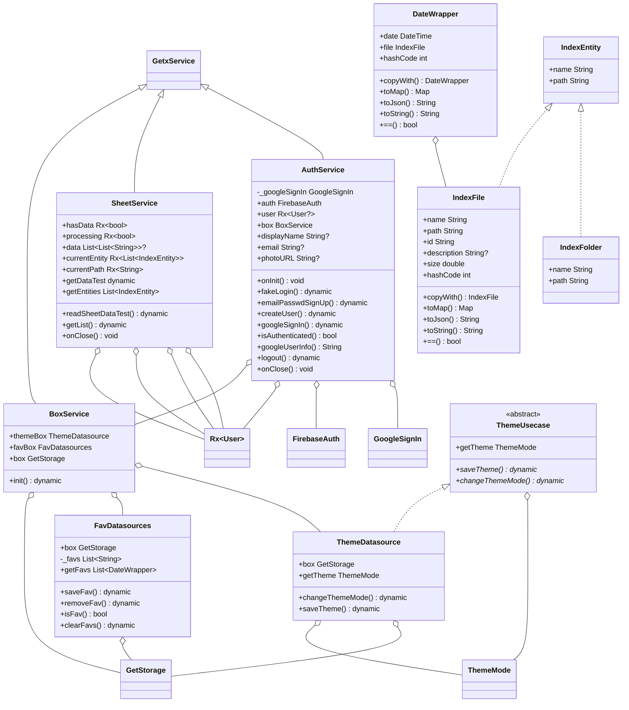

```mermaid

classDiagram

class AuthService
AuthService : -_googleSignIn GoogleSignIn
AuthService o-- GoogleSignIn
AuthService : +auth FirebaseAuth
AuthService o-- FirebaseAuth
AuthService : +user Rx~User?~
AuthService o-- Rx~User~
AuthService : +box BoxService
AuthService o-- BoxService
AuthService : +displayName String?
AuthService : +email String?
AuthService : +photoURL String?
AuthService : +onInit() void
AuthService : +fakeLogin() dynamic
AuthService : +emailPasswdSignUp() dynamic
AuthService : +createUser() dynamic
AuthService : +googleSignIn() dynamic
AuthService : +isAuthenticated() bool
AuthService : +googleUserInfo() String
AuthService : +logout() dynamic
AuthService : +onClose() void
GetxService <|-- AuthService

class SheetService
SheetService : +hasData Rx~bool~
SheetService o-- Rx~bool~
SheetService : +processing Rx~bool~
SheetService o-- Rx~bool~
SheetService : +data List~List~String~~?
SheetService : +currentEntity Rx~List~IndexEntity~~
SheetService o-- Rx~List~
SheetService : +currentPath Rx~String~
SheetService o-- Rx~String~
SheetService : +getDataTest dynamic
SheetService : +getEntities List~IndexEntity~
SheetService : +readSheetDataTest() dynamic
SheetService : +getList() dynamic
SheetService : +onClose() void
GetxService <|-- SheetService

class IndexEntity
IndexEntity : +name String
IndexEntity : +path String

class IndexFolder
IndexFolder : +name String
IndexFolder : +path String
IndexEntity <|.. IndexFolder

class IndexFile
IndexFile : +name String
IndexFile : +path String
IndexFile : +id String
IndexFile : +description String?
IndexFile : +size double
IndexFile : +hashCode int
IndexFile : +copyWith() IndexFile
IndexFile : +toMap() Map<String, dynamic>
IndexFile : +toJson() String
IndexFile : +toString() String
IndexFile : +==() bool
IndexEntity <|.. IndexFile

class DateWrapper
DateWrapper : +date DateTime
DateWrapper : +file IndexFile
DateWrapper o-- IndexFile
DateWrapper : +hashCode int
DateWrapper : +copyWith() DateWrapper
DateWrapper : +toMap() Map<String, dynamic>
DateWrapper : +toJson() String
DateWrapper : +toString() String
DateWrapper : +==() bool

class BoxService
BoxService : +themeBox ThemeDatasource
BoxService o-- ThemeDatasource
BoxService : +favBox FavDatasources
BoxService o-- FavDatasources
BoxService : +box GetStorage
BoxService o-- GetStorage
BoxService : +init() dynamic
GetxService <|-- BoxService

class ThemeUsecase
<<abstract>> ThemeUsecase
ThemeUsecase : +getTheme ThemeMode
ThemeUsecase o-- ThemeMode
ThemeUsecase : +saveTheme()* dynamic
ThemeUsecase : +changeThemeMode()* dynamic

class FavDatasources
FavDatasources : +box GetStorage
FavDatasources o-- GetStorage
FavDatasources : -_favs List~String~
FavDatasources : +getFavs List~DateWrapper~
FavDatasources : +saveFav() dynamic
FavDatasources : +removeFav() dynamic
FavDatasources : +isFav() bool
FavDatasources : +clearFavs() dynamic

class ThemeDatasource
ThemeDatasource : +box GetStorage
ThemeDatasource o-- GetStorage
ThemeDatasource : +getTheme ThemeMode
ThemeDatasource o-- ThemeMode
ThemeDatasource : +changeThemeMode() dynamic
ThemeDatasource : +saveTheme() dynamic
ThemeUsecase <|.. ThemeDatasource

```
